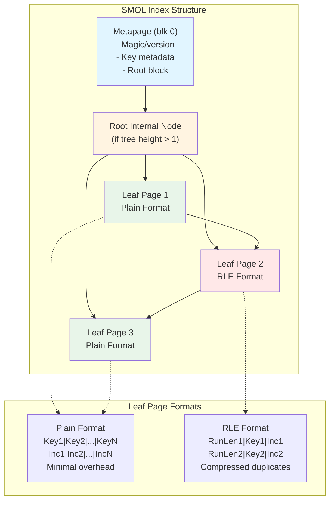

# smol — Simple Memory-Only Lightweight index

[](https://github.com/asah/smol/actions/workflows/ci.yml)

SMOL is a read‑only, space‑efficient PostgreSQL index access method optimized for reporting queries on fixed-width columns. Think of SMOL as a space-optimized, read-only variant of BTREE for analytical workloads.

**Disclaimer**: While generally safe (read only!) and has an extensive test suite with 100% code coverage, please consider SMOL as an unsupported research prototype with highly variable performance characteristics, limited observability and other issues that limit its applicability for production use. For the foreseeable future, only self-hosted PostgreSQL deployments only (not AWS RDS/Aurora). The author is very experienced and open to commercialization on very generous terms, please contact to discuss.

## Performance

Depending on compression, SMOL indexes can be 20-99+% smaller than BTREE, while providing competitive performance. 

### When to Use SMOL

**Use SMOL when:**
- Memory-constrained environments (cloud, containers)
- Read-heavy workloads (data warehouses, reporting, analytics)
- Data with duplicate keys (compression excels)
- Fixed-width columns (int2/4/8, date, uuid, timestamp)
- Index size matters (backups, restores, cache efficiency)

**Use BTREE when:**
- Write-heavy workloads (SMOL is strictly read-only)
- Variable-length keys, strings without C collation, keys with NULL values
- Very low selectivity point queries (< 1%) - BTREE is faster for single record lookups. Also consider HASH indexes.

BRIN is another way to compress indexes but cannot support index-only scans. BRIN may be useful in cases when SMOL compression is not impressive, e.g. lots of unique keys, wide columns, etc. BRIN is production ready, while SMOL is still in development.


## Quick Start

### Prerequisites

Table must be read-only (or use an UNLOGGED copy). String columns must use C collation.

```sql
CREATE EXTENSION smol;

-- Create index
CREATE INDEX idx_name ON table_name USING smol (key_column)
  INCLUDE (other, columns);

-- CRITICAL: Run ANALYZE for optimal query plans
ANALYZE table_name;

-- Use the index
SELECT key_column, other, columns
FROM table_name
WHERE key_column >= some_value;
```

### Build & Test

**Docker host**:
```bash
make dbuild          # Build container image
make dstart          # Start container + PostgreSQL
make dexec           # login to container
make dpsql           # one step login to container and run psql
```

**Local** (inside container or native):
```bash
make production      # (re)build optimized/non-debug version from scratch
make coverage        # Generate coverage report
make bench-quick     # quick benchmark test
make bench-full      # comprehensive benchmark test

make build           # Clean build + install
make start           # Start PostgreSQL
make stop            # Stop PostgreSQL
make installcheck    # Run tests
```

## Capabilities & Limitations

### Supported
- Index-only scans (required)
- Forward and backward scans
- Parallel scans
- Range queries (<, <=, =, >=, >)
- Multi-column indexes (fixed-width columns only)
- INCLUDE columns (fixed-width types)
- Data types: int2/4/8, date, timestamp, timestamptz, uuid, float4/8, bool, oid, etc.

### Not Supported
- Write operations (strictly read-only)
- NULL values in index keys
- Bitmap scans
- Variable-length keys without C collation
- Index-only scans with heap lookups (SMOL requires IOS)

### Prototype Limitations
- No WAL logging (not crash-safe)
- No FSM (free space map)

## Use Cases

**SMOL excels at:**
- Time-series data with duplicate timestamps
- Dimension tables (many lookups on same keys)
- Event logs with categorical data
- Analytics dashboards (read-heavy, memory-constrained)
- Reporting databases (periodic rebuilds acceptable)

**Example workload**: 1M row time-series table with 50 distinct metric_ids, queried by metric_id for aggregation. SMOL's RLE compression dramatically reduces index size while maintaining fast scans.

## Documentation

- `AGENT_NOTES.md` - Detailed implementation notes for developers
- `COVERAGE_ENFORCEMENT.md` - Testing and coverage policy
- `bench/` - Benchmark suite and methodology

## How SMOL Works

SMOL uses a B-tree structure like nbtree, but optimized for read-only access:

1. **Read-only assumption**: No visibility checks, no MVCC overhead
2. **Columnar storage**: Attributes stored in column-major format within pages
3. **Metadata hoisting**: Per-tuple metadata stored once per page, not per tuple
4. **Adaptive compression**: Run-length encoding (RLE) for duplicate-heavy data, plain format for unique data
5. **Tuple caching**: Pre-built tuple structures reduce per-row overhead
6. **C collation**: Text treated as fixed-width binary data for efficient comparison
7. **Lookup and Scan Optimizations**: Several advanced techniques for optimizing query performance, including page prefetch, zone maps and bloom filters

### Design Decision: Plain Format vs Zero-Copy

During development, we explored a "zero-copy" format that pre-materialized IndexTuple structures on disk to avoid memcpy during scans. **This was abandoned** because:

1. PostgreSQL's index-only scan protocol requires tuple construction anyway
2. The per-tuple overhead doubled index size for narrow rows, hurting I/O and cache efficiency
3. Benchmarks showed no performance benefit (slightly slower due to extra I/O)

**Current approach**: SMOL uses plain format for unique data and RLE compression for duplicate-heavy data, chosen adaptively per page.

### Index Structure



### Scan Process


### Compression Decision


