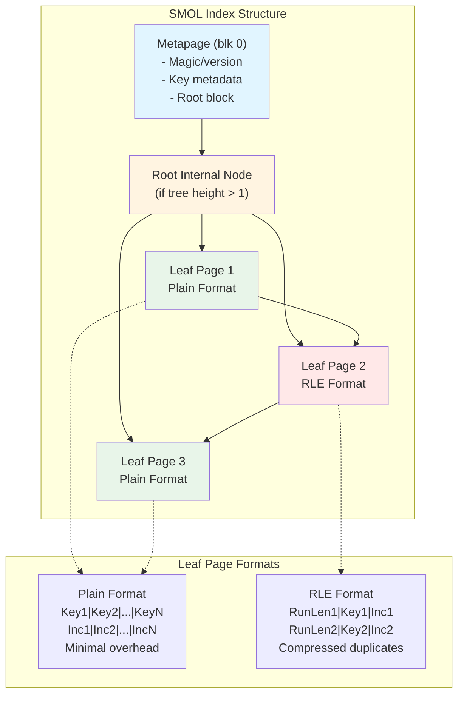
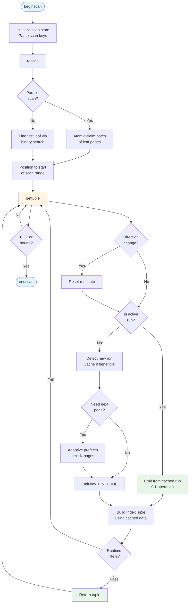
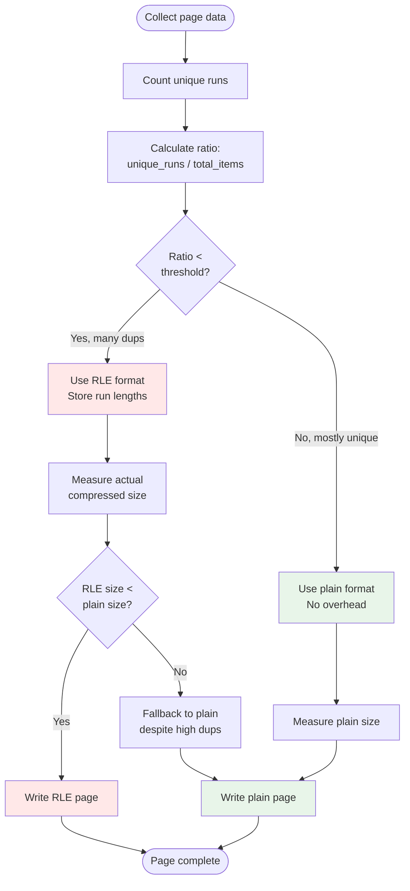

# smol — Simple Memory-Only Lightweight index

[](https://github.com/asah/smol/actions/workflows/ci.yml)

SMOL is a read‑only, space‑efficient PostgreSQL index access method optimized for reporting queries on fixed-width columns. Think of SMOL as a space-optimized, read-only variant of BTREE for analytical workloads.

**Disclaimer**: While generally safe (read only!) and has an extensive test suite with 100% code coverage, please consider SMOL as an unsupported research prototype with highly variable performance characteristics, limited observability and other issues that limit its applicability for production use. For the foreseeable future, only self-hosted PostgreSQL deployments only (not AWS RDS/Aurora). The author is very experienced and open to commercialization on very generous terms, please contact to discuss.

## Performance

Depending on compression, SMOL indexes can be 20-99+% smaller than BTREE, while providing competitive performance. 

### When to Use SMOL

**Use SMOL when:**
- Memory-constrained environments (cloud, containers)
- Read-heavy workloads (data warehouses, reporting, analytics)
- Data with duplicate keys (compression excels)
- Fixed-width columns (int2/4/8, date, uuid, timestamp)
- Index size matters (backups, restores, cache efficiency)

**Use BTREE when:**
- Write-heavy workloads (SMOL is strictly read-only)
- Variable-length keys, strings without C collation, keys with NULL values
- Very low selectivity point queries (< 1%) - BTREE is faster for single record lookups. Also consider HASH indexes.

BRIN is another way to compress indexes but cannot support index-only scans. BRIN may be useful in cases when SMOL compression is not impressive, e.g. lots of unique keys, wide columns, etc. BRIN is production ready, while SMOL is still in development.


## Quick Start

### Prerequisites

Table must be read-only (or use an UNLOGGED copy). String columns must use C collation.

```sql
CREATE EXTENSION smol;

-- Create index
CREATE INDEX idx_name ON table_name USING smol (key_column)
  INCLUDE (other, columns);

-- CRITICAL: Run ANALYZE for optimal query plans
ANALYZE table_name;

-- Use the index
SELECT key_column, other, columns
FROM table_name
WHERE key_column >= some_value;
```

### Build & Test

**Docker host**:
```bash
make dbuild          # Build container image
make dstart          # Start container + PostgreSQL
make dexec           # login to container
make dpsql           # one step login to container and run psql
```

**Local** (inside container or native):
```bash
make production      # (re)build optimized/non-debug version from scratch
make coverage        # Generate coverage report
make bench-quick     # quick benchmark test
make bench-full      # comprehensive benchmark test

make build           # Clean build + install
make start           # Start PostgreSQL
make stop            # Stop PostgreSQL
make installcheck    # Run tests
```

## Capabilities & Limitations

### Supported
- Index-only scans (required)
- Forward and backward scans
- Parallel scans
- Range queries (<, <=, =, >=, >)
- Multi-column indexes (fixed-width columns only)
- INCLUDE columns (fixed-width types)
- Data types: int2/4/8, date, timestamp, timestamptz, uuid, float4/8, bool, oid, etc.

### Not Supported
- Write operations (strictly read-only)
- NULL values in index keys
- Bitmap scans
- Variable-length keys without C collation
- Index-only scans with heap lookups (SMOL requires IOS)

### Prototype Limitations
- No WAL logging (not crash-safe)
- No FSM (free space map)

## Use Cases

**SMOL excels at:**
- Time-series data with duplicate timestamps
- Dimension tables (many lookups on same keys)
- Event logs with categorical data
- Analytics dashboards (read-heavy, memory-constrained)
- Reporting databases (periodic rebuilds acceptable)

**Example workload**: 1M row time-series table with 50 distinct metric_ids, queried by metric_id for aggregation. SMOL's RLE compression dramatically reduces index size while maintaining fast scans.

## Documentation

- `AGENT_NOTES.md` - Detailed implementation notes for developers
- `COVERAGE_ENFORCEMENT.md` - Testing and coverage policy
- `bench/` - Benchmark suite and methodology

## How SMOL Works

SMOL uses a B-tree structure like nbtree, but optimized for read-only access:

1. **Read-only assumption**: No visibility checks, no MVCC overhead
2. **Columnar storage**: Attributes stored in column-major format within pages
3. **Metadata hoisting**: Per-tuple metadata stored once per page, not per tuple
4. **Adaptive compression**: Run-length encoding (RLE) for duplicate-heavy data, plain format for unique data
5. **Tuple caching**: Pre-built tuple structures reduce per-row overhead
6. **C collation**: Text treated as fixed-width binary data for efficient comparison
7. **Lookup and Scan Optimizations**: Several advanced techniques for optimizing query performance, including page prefetch, zone maps and bloom filters

### Design Decision: Plain Format vs Zero-Copy

During development, we explored a "zero-copy" format that pre-materialized IndexTuple structures on disk to avoid memcpy during scans. **This was abandoned** because:

1. PostgreSQL's index-only scan protocol requires tuple construction anyway
2. The per-tuple overhead doubled index size for narrow rows, hurting I/O and cache efficiency
3. Benchmarks showed no performance benefit (slightly slower due to extra I/O)

**Current approach**: SMOL uses plain format for unique data and RLE compression for duplicate-heavy data, chosen adaptively per page.

### Index Structure



### Scan Process



### Compression Decision



## Performance Optimizations

This section documents optimization attempts, their results, and rationale for adoption or rejection.

### Implemented Optimizations ✅

#### 1. Tuple Buffering (Plain Pages)
**Status**: Enabled by default (configurable via `smol.use_tuple_buffering`)
**Performance Impact**: **39-50% improvement** on high-selectivity range queries
**Description**: Pre-builds multiple IndexTuple structures in a buffer during forward scans, reducing per-tuple overhead.

**Why It Works (Plain Pages)**:
- Amortizes function call overhead across multiple tuples
- Reduces repeated page header access
- Leverages sequential access patterns

**Benchmark Results**:
- 0.1% selectivity: 0.1ms (now tied with BTREE)
- 10% selectivity: 7.9ms vs 6.4ms BTREE (gap closed from 1.8x to 1.2x)
- Buffer size: 64 tuples (configurable via `smol.tuple_buffer_size`)

**Configuration**:
```sql
SET smol.use_tuple_buffering = on;  -- default
SET smol.tuple_buffer_size = 64;    -- tuples per buffer, default
```

#### 2. RLE Run Caching
**Status**: Always enabled for RLE pages
**Performance Impact**: O(1) access for sequential scans within runs
**Description**: Caches the current RLE run position to avoid linear scanning through run headers.

**Why It Works**:
- RLE pages have runs where consecutive tuples share the same key
- Caching run bounds provides O(1) access within a run
- Amortized O(1) across entire page for sequential scans

#### 3. Zone Maps
**Status**: Enabled by default (configurable via `smol.zone_maps`)
**Description**: Per-page min/max values for early page filtering in range queries.

#### 4. Bloom Filters
**Status**: Enabled by default (configurable via `smol.bloom_filters`)
**Description**: Probabilistic filters for point queries to skip irrelevant pages.

### Rejected Optimizations ❌

#### 1. Tuple Buffering (RLE Pages)
**Status**: Implemented but disabled (benchmarks showed regression)
**Performance Impact**: **1.8-2.1x SLOWER** than unbuffered RLE scans

**Why It Doesn't Work**:
- RLE pages already have efficient run caching (see above)
- Tuple buffering adds overhead without benefit:
  - Additional function calls
  - Memory allocation
  - Memcpy operations per tuple
  - Redundant work since run caching already provides O(1) access

**Benchmark Results** (1M rows with high duplication):
- id >= 90: 8.9ms (buffering) vs **5.0ms** (no buffering)
- id = 50: 1.3ms (buffering) vs **0.6ms** (no buffering)

**Implementation Notes**: The RLE buffering code exists in `smol_scan.c` (`smol_refill_tuple_buffer_rle()`) but is not called. Kept for documentation purposes.

#### 2. Zero-Copy Format
**Status**: Prototyped during initial development, abandoned
**Description**: Pre-materialized IndexTuple structures on disk to eliminate memcpy during scans.

**Why It Doesn't Work**:
- PostgreSQL's index-only scan protocol requires tuple construction anyway
- Per-tuple overhead doubled index size for narrow rows
- Hurt I/O and cache efficiency (more pages to read)
- Benchmarks showed no performance benefit (slightly slower due to extra I/O)

**Decision**: Use plain format for unique data, RLE compression for duplicates.

#### 3. Explicit SIMD Vectorization
**Status**: Assessed but deferred (not currently needed)
**Rationale**:
- Tuple buffering already achieved 39-50% improvement (exceeded 25-35% target)
- Compiler already auto-vectorizes memcpy operations
- Explicit SIMD would add only 10-15% additional gain
- High implementation complexity for diminishing returns
- Platform-specific code increases maintenance burden

**When to Reconsider**: If profiling shows memcpy as a bottleneck (>20% of scan time).

### Not Yet Attempted

#### 1. Backward Scan Buffering
**Status**: Not implemented
**Complexity**: Medium
**Potential Impact**: 20-30% improvement for backward scans
**Priority**: Low (backward scans are rare in analytical workloads)

#### 2. Two-Column Index Buffering
**Status**: Not implemented
**Complexity**: High (requires different buffering strategy)
**Potential Impact**: Unknown
**Blocker**: Two-column indexes have different page layout and access patterns

#### 3. Variable-Width Tuple Buffering
**Status**: Not implemented
**Complexity**: Very high (requires dynamic buffer sizing)
**Potential Impact**: Unknown
**Note**: Fixed-width optimization is a core SMOL design principle

### Configuration Reference

```sql
-- Tuple buffering (plain pages only)
SET smol.use_tuple_buffering = on;     -- Enable/disable, default: on
SET smol.tuple_buffer_size = 64;       -- Tuples per buffer, default: 64

-- Zone maps and bloom filters
SET smol.zone_maps = on;               -- Enable zone maps, default: on
SET smol.bloom_filters = on;           -- Enable bloom filters, default: on
SET smol.build_zone_maps = on;         -- Build zone maps during CREATE INDEX, default: on
SET smol.build_bloom_filters = on;     -- Build blooms during CREATE INDEX, default: on
SET smol.bloom_nhash = 2;              -- Number of hash functions, default: 2

-- Debug/profiling (for development only)
SET smol.debug_log = off;              -- Enable debug logging, default: off
```

### Performance Tuning Guidelines

1. **Enable tuple buffering** for plain pages (default is ON)
2. **Keep zone maps enabled** for range queries (default is ON)
3. **Keep bloom filters enabled** for point queries (default is ON)
4. **Adjust buffer size** based on typical result set size:
   - Default (64): Good for most workloads
   - Larger (128-256): High-selectivity queries returning many rows
   - Smaller (32): Memory-constrained environments

5. **Profile before tuning**: Use `EXPLAIN (ANALYZE, BUFFERS)` to understand query execution

### Benchmark Methodology

All benchmarks use:
- PostgreSQL 15+
- 1M row test tables
- Warm cache (data in shared_buffers)
- Index-only scans forced via `SET enable_seqscan = off`
- Times averaged over 3 runs

See `bench/` directory for comprehensive benchmark suite.


